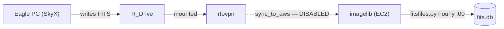
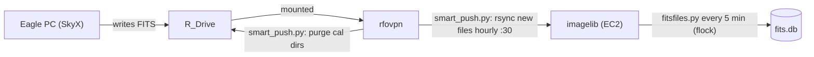

# imagelib Data Flow

End-to-end documentation of how FITS images travel from the telescope to the imagelib
web application, including the current ingest architecture and the proposed smart sync
replacing the legacy rsync.

---

## Flow Diagrams

### Current State — sync_to_aws disabled



sync_to_aws did three things (all now disabled): purge calibration dirs from R_Drive, rsync the entire Eagle/ tree (~50k files), and SSH-trigger fitsfiles.py. It was disabled after step 2 re-pushed all historical files following the YYYY/MM/DD directory reorganization.

### Proposed State — two focused scripts



smart_push.py runs as a single hourly job: it first purges calibration dirs from R_Drive, then scans for new files. This matches the ordering in sync_to_aws (purge before rsync). The SSH trigger is eliminated; fitsfiles.py runs on its own every-5-minute cron on imagelib, guarded by `flock -n` to prevent overlapping runs.

---

## System Components

| Component | Location | Role |
|---|---|---|
| Eagle PC | Observatory (Windows) | Telescope control; SkyX captures exposures |
| R_Drive | Observatory (NAS, RAID1 3TB) | Primary archive of all raw FITS files |
| rfovpn | Observatory server (Linux) | Mounts R_Drive; gateway to AWS over VPN |
| imagelib | AWS EC2 (Linux, `/home/nas/Eagle/`) | Database, web server, compressed image store |

---

## File Formats in Play

| Extension | Description | Where it lives |
|---|---|---|
| `.fits` / `.fit` | Raw uncompressed FITS | R_Drive (always); imagelib (transiently during ingest) |
| `.fits.fz` | RICE-compressed FITS (astropy `CompImageHDU`) | imagelib permanent store; future R_Drive output when SkyX/NINA is reconfigured |

---

## Directory Structures

**R_Drive (observatory, source of truth):**
```
/nas/R_Drive/Eagle/
    SkyX/Images/
        YYYY-MM-DD/      ← SkyX assigns date from local observatory clock
            filename.fits
        Closed Loop Slews/          ← calibration artifact, purged by cleanup_rfo_dirs.py
        Automated Pointing Run .../  ← calibration artifact, purged by cleanup_rfo_dirs.py
    NINA/
    Asterism/
```

**imagelib (AWS, permanent store):**
```
/home/nas/Eagle/SkyX/Images/
    YYYY/MM/DD/          ← date from DATE-OBS header (UTC)
        filename.fits.fz
    Asterism/rfo/
        YYYY/MM/DD/
            filename.fits.fz
```

---

## Current Flow (post PRs #41–44)

### 1. Capture (observatory)

```
Telescope → SkyX → R_Drive/SkyX/Images/YYYY-MM-DD/filename.fits
```

SkyX names the date directory from the local observatory clock (Pacific time).

### 2. Sync to imagelib — CURRENTLY DISABLED

The legacy `sync_to_aws` script on rfovpn has been commented out because it
re-pushed the entire historical archive after the YYYY/MM/DD reorganization.
No automated sync is running. Files only reach imagelib if pushed manually.

**What `sync_to_aws` did (three functions, one script):**

```bash
nas=/nas/R_Drive/Eagle
aws=54.148.172.109

# 1. Purge: delete SkyX calibration artifact directories from R_Drive
find $nas \( -name 'Closed Loop Slews' -o -name 'Automated Pointing Run*' \) \
     -type d -print0 | xargs -0 rm -rfv

# 2. Sync: rsync the entire Eagle directory tree to imagelib (all sources, unfiltered)
rsync -av $nas nas@$aws:

# 3. Trigger: SSH to imagelib and run fitsfiles.py immediately after sync
ssh $aws '(date; cd /home/nas/flask/imagelib; python3 ./fitsfiles.py) \
          >> /tmp/fitsfiles.out 2>&1'
```

Problems with this design:
- **Sync** had no knowledge of what imagelib had already ingested, so it re-pushed
  all ~50,000 historical files after the YYYY/MM/DD reorganization
- **Sync** mirrored the `YYYY-MM-DD` directory structure; imagelib now expects
  `YYYY/MM/DD` with RICE compression — rsync cannot bridge this structural difference
- **Trigger** is redundant now that fitsfiles.py runs on its own hourly cron

### 3. Ingest on imagelib (`fitsfiles.py`, hourly cron)

When a `.fits`, `.fit`, or `.fits.fz` file appears under
`/home/nas/Eagle/`, `fitsfiles.py` picks it up on the next cron run via
`find -newer tsfile`.

**Per-file processing in `addFitsFile()`:**

```
parseFitsHeader()
    └─ astropy opens file (handles .fits, .fit, .fits.fz transparently)
    └─ extracts DATE-OBS, OBJECT, IMAGETYP, EXPTIME, FILTER, NAXIS1/2, etc.

_maybe_organize()           [Asterism files only]
    └─ if file is in ASTERISM_DROP flat folder:
         copy to ASTERISM_DROP/YYYY/MM/DD/, verify size, delete original

_maybe_compress_skyx()      [SkyX files only]
    └─ if file is under SkyX/Images/ but NOT in YYYY/MM/DD structure:
         ┌─ dest_fz already exists on disk?
         │    └─ delete incoming duplicate, return existing path (re-sync guard)
         ├─ file is .fits.fz?
         │    └─ copy to SkyX/Images/YYYY/MM/DD/, delete original
         └─ file is .fits/.fit?
              compress to temp .fits.fz (RICE_1) in source directory
              verify pixels with np.array_equal
              move .fits.fz to SkyX/Images/YYYY/MM/DD/
              delete original .fits/.fit
         └─ attempt os.rmdir on source YYYY-MM-DD directory (no-op if non-empty)
         └─ on any failure: log error, return original path unchanged

buildDatabaseRecord()
    └─ derives target, imagetype, date (from DATE-OBS UTC), filter, binning, etc.
    └─ record['path'] = final .fits.fz path in YYYY/MM/DD

fits2png()
    └─ calls fitspng CLI (via safe temp-rename workaround for complex filenames)
    └─ generates full-res preview .png and thumbnail -thumb.png alongside .fits.fz

db.insert()
    └─ inserts into fits table; UNIQUE constraint on path silently skips duplicates
```

**YYYY-MM-DD directory cleanup:** after each file is deleted from its source
directory, `os.rmdir` is attempted on that directory. It succeeds only if the
directory is now empty and fails silently otherwise. smart_push (or rsync)
recreates the directory on the next push if needed.

---

## Proposed Flow — two scripts replace sync_to_aws

The three functions of `sync_to_aws` are replaced by two focused scripts and
one eliminated step:

| sync_to_aws function | Replacement |
|---|---|
| Purge calibration dirs from R_Drive | `bin/smart_push.py` step 1 (before each scan) |
| Sync FITS files to imagelib | `bin/smart_push.py` step 2 (manifest-driven rsync) |
| SSH trigger for fitsfiles.py | **Eliminated** — fitsfiles.py runs on its own every-5-min cron on imagelib, guarded by `flock -n` to prevent overlap |

### Crontabs (proposed)

**rfovpn** — syncs new files to imagelib:
```cron
# Sync new SkyX FITS files to imagelib — also purges cal dirs before each scan
30 * * * * SMART_PUSH_HOST=nas@54.148.172.109 python3 /usr/local/bin/smart_push.py --apply >> /tmp/smart_push.out 2>&1
```

**imagelib** — ingests files into the database:
```cron
# Ingest new FITS files; flock -n skips if previous run is still active
*/5 * * * * flock -n /var/lock/fitsfiles.lock -c 'cd /home/nas/flask/imagelib && python3 fitsfiles.py >> /tmp/fitsfiles.out 2>&1'
```

`flock -n` is non-blocking: if a prior run holds the lock, the new invocation exits immediately without queuing. This keeps cron from stacking up during a large backlog run. Worst-case latency between a file landing on imagelib and appearing in the DB is 5 minutes (if files arrive just after a fitsfiles.py run completes).

### smart_push.py — why rsync was wrong

rsync mirrors directory structure. The source (R_Drive) has `YYYY-MM-DD`;
the destination (imagelib) now uses `YYYY/MM/DD` with RICE compression. rsync
has no awareness of what imagelib has already ingested, so it re-pushes the
entire ~50,000-file historical archive after any reorganization.

### Design principles

- **DATE-OBS is the unique identifier.** It is stored in every FITS header and
  in the imagelib DB `timestamp` column. It is unique per exposure, format-
  independent, and survives renaming, compression, and directory restructuring.
- **`find -newer tsfile` limits candidates.** Only files added to R_Drive since
  the last run are examined — typically 50–200 files per night, not 50,000.
- **astropy reads headers.** Handles `.fits`, `.fit`, and `.fits.fz` identically
  without special casing. No fragility across FITS versions.
- **Manifest DB on rfovpn is the sync state.** imagelib's DB is never queried
  at runtime; it is used only during the one-time bootstrap.

### Manifest database (on rfovpn)

```sql
-- Files rfovpn has successfully pushed to imagelib
CREATE TABLE sent (
    date_obs     TEXT PRIMARY KEY,   -- FITS DATE-OBS (authoritative unique key)
    r_drive_path TEXT NOT NULL,      -- R_Drive relative path (audit/debug only)
    sent_at      TEXT NOT NULL       -- ISO timestamp of push
);

-- DATE-OBS values already ingested on imagelib before smart_push existed (bootstrap)
CREATE TABLE known_ingested (
    date_obs TEXT PRIMARY KEY
);
```

### Bootstrap (one-time)

Pre-populate `known_ingested` from imagelib's DB so historical files are never
pushed:

```bash
# On imagelib:
sqlite3 /home/nas/data/fits.db \
  "SELECT timestamp FROM fits WHERE path LIKE '%SkyX%'" > bootstrap.txt

# Transfer bootstrap.txt to rfovpn, then:
python3 smart_push.py --bootstrap bootstrap.txt
```

No R_Drive walk required. Bootstrap inserts are idempotent (PRIMARY KEY conflict
is silently ignored).

### Per-run algorithm

```
record start_time

# step 1: purge calibration dirs before scanning
for each dir in R_DRIVE matching Closed Loop Slews or Automated Pointing Run*:
    rmtree(dir)   [errors counted; run continues]

# step 2: find candidates added since last successful run
candidates = find(R_DRIVE, newer_than=tsfile, names=['*.fits','*.fit','*.fits.fz'],
                  exclude_dirs=SKIP_DIR_PATTERNS)  ← safety net in case step 1 missed one

for each candidate:
    date_obs = astropy.fits.open(candidate) → DATE-OBS header
    if date_obs is None:
        log warning, skip
        continue
    if date_obs in sent OR date_obs in known_ingested:
        skip (already on imagelib or already ingested pre-bootstrap)
    rsync candidate → imagelib:/home/nas/Eagle/SkyX/Images/YYYY-MM-DD/filename
    if rsync exit 0:
        INSERT INTO sent (date_obs, r_drive_path, sent_at)

touch tsfile with start_time   [only on zero-error run]
```

### smart_push.py step 1 — calibration artifact purge

Before scanning for candidates, `smart_push.py` walks `R_DRIVE_BASE` and removes
directories whose names match `Closed Loop Slews` or start with
`Automated Pointing Run`. These are created by SkyX during telescope calibration
and must be purged before the `find -newer` scan so their files are never picked
up as sync candidates. This mirrors the ordering in the original `sync_to_aws`
script (purge, then rsync). The `find` call also excludes these directory names
as a safety net in case an `rmtree` fails mid-run.

### imagelib side — no changes required

Files arrive at imagelib in `SkyX/Images/YYYY-MM-DD/` format.
`_maybe_compress_skyx` handles compression, reorganization, and cleanup exactly
as it does today. smart_push is transparent to imagelib's ingest pipeline.

### .fits.fz support (future SkyX/NINA reconfiguration)

smart_push.py already includes `*.fits.fz` in its `find` patterns. When
SkyX or NINA is reconfigured to write `.fits.fz` directly to R_Drive,
**no change to smart_push.py is required**. astropy reads DATE-OBS from
`.fits.fz` headers identically to uncompressed files, and `_maybe_compress_skyx`
already handles incoming `.fits.fz` files (moves them to `YYYY/MM/DD/` without
re-compressing, with the re-sync duplicate guard).

### Failure modes and recovery

| Failure | Effect | Recovery |
|---|---|---|
| File has no DATE-OBS header | Moved to `SkyX/_no_date_obs/` on R_Drive; not synced | Inspect file; fix header; move back to a date directory |
| Quarantine move fails | File left on R_Drive; counted as error; tsfile not updated | Fix filesystem permissions on `_no_date_obs/`; next run retries |
| rsync fails for one file | Not inserted into `sent`; retried next cron run | Automatic |
| rfovpn crashes mid-run | Partial `sent` entries for completed files only | Automatic (next run retries missing files) |
| tsfile lost | Next run walks all of R_Drive once; `sent` table prevents re-pushing | Automatic (slow one-time run) |
| Manifest DB lost | Next run finds all 50k files; `known_ingested` must be re-bootstrapped | Re-run bootstrap; then `find -newer` resumes normal cadence |
| imagelib DB has duplicate path | `db.insert` UNIQUE constraint silently ignores it | Automatic |

---

## Key Design Decisions

**DATE-OBS as the universal key, not file path.**
The directory structure on R_Drive (YYYY-MM-DD, local time) and on imagelib
(YYYY/MM/DD, UTC from DATE-OBS) can differ by one day for late-night
observations. Only the FITS header value itself is reliable across both systems.

**R_Drive science images are never modified.**
All compression and reorganization of FITS image files happens on imagelib.
R_Drive retains the original uncompressed archive indefinitely. The only
writes to R_Drive are deletions of SkyX calibration artifact directories
(`cleanup_rfo_dirs.py`), which were always discarded and are not science data.

**`_maybe_compress_skyx` is idempotent.**
If a file already exists at the destination (re-synced or retried), the incoming
duplicate is deleted and the existing compressed file is returned. This makes
the entire ingest pipeline safe to re-run without side effects.

**Compression location is source-agnostic.**
Files may arrive compressed (`.fits.fz`, when SkyX/NINA is reconfigured) or
uncompressed (`.fits`/`.fit`, current default). `_maybe_compress_skyx` handles
both: it compresses incoming uncompressed files on imagelib, and moves already-
compressed files without re-compressing. No code change is required when the
source switches format. Network bandwidth decreases naturally once the source
writes `.fits.fz` directly; no design decision forces it either way.
